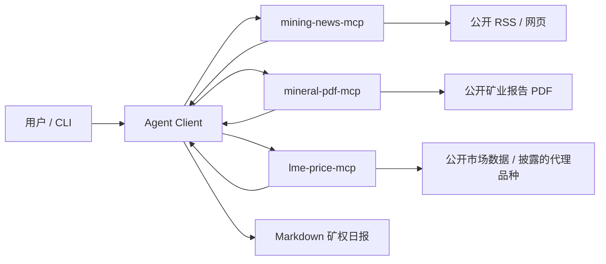

# 系统架构

## 1. 目标

系统接收自然语言请求，例如：

```text
给我生成一份关于 Pilbara 锂矿的今日简报
```

Agent 通过 MCP 协议调用新闻、矿业报告和价格三个独立服务，最终生成包含引用与数据状态的 Markdown 简报。

## 2. 组件关系



## 3. Agent 数据流

1. 从用户问题识别研究对象和主要矿种。
2. 并行启动三个 MCP stdio 会话。
3. 并行调用 `search`、`extract_resources` 和 `get_trend`。
4. 对前 3 条新闻调用 `fetch_article` 补充正文片段。
5. 校验统一数据契约，保留 `live`、`demo` 或 `unavailable` 状态。
6. 对引用 URL 去重，并记录 UTC 生成时间。
7. 有模型密钥时使用 OpenAI-compatible API 组织简报；否则使用确定性渲染器。
8. 输出新闻、资源量、价格、风险和引用五个固定章节。

## 4. 可靠性设计

- 三个 MCP Server 相互独立，单一数据源故障不会阻止其他数据返回。
- 所有工具显式返回 `live`、`demo` 或 `unavailable`，避免静默伪造实时数据。
- PDF 未可靠匹配时返回待人工审核，而非猜测表格数值。
- 外部下载仅允许公网 HTTP(S)，每次重定向均重新校验目标。
- 新闻正文限制为 3 MB，PDF 限制为 25 MB，并校验 Content-Type。
- 只有显式离线模式或 `demo://` 输入可返回 DEMO；线上异常返回 `UNAVAILABLE`。
- 模型 API 不是运行前提；模型调用失败会自动降级。
- 外部网页和 PDF 只作为不可信数据处理，不作为 Agent 指令执行。

## 5. 扩展方向

- 将保守正则升级为表格检测、OCR 和多模型审核循环。
- 为 MCP Server 增加 HTTP/SSE 部署方式。
- 接入缓存、可观测性和定时日报任务。
- 使用真实锂精矿或碳酸锂授权行情替换 ETF 代理。
